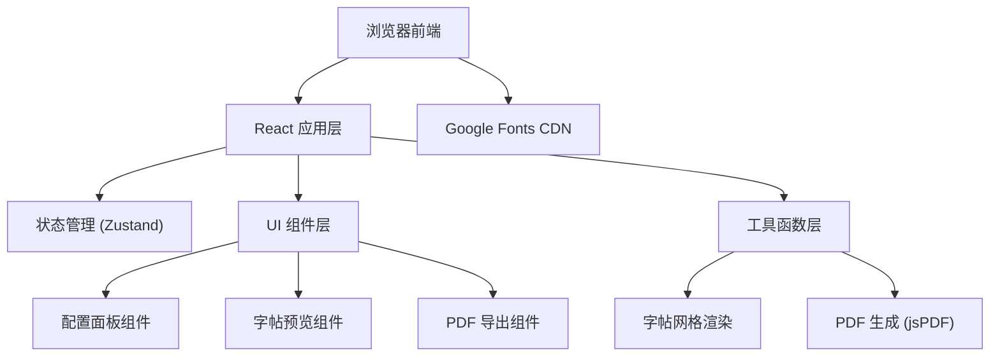

## 1. 架构设计



## 2. 技术描述

- **前端框架**：React 18 + TypeScript + Vite
- **样式方案**：Tailwind CSS 3
- **状态管理**：Zustand
- **图标库**：Lucide React
- **PDF 生成**：jsPDF + html2canvas
- **字体加载**：Google Fonts（Noto Serif SC、Ma Shan Zheng、ZCOOL KuaiLe、Liu Jian Mao Cao、Long Cang、Dancing Script、Caveat 等）
- **初始化工具**：vite-init（react-ts 模板）
- **后端**：无后端，纯前端静态应用

## 3. 路由定义

| 路由 | 用途 |
|-------|---------|
| / | 字帖生成器主页面（唯一页面） |

## 4. 核心数据模型

### 字帖配置状态 (Zustand Store)

```typescript
interface CopybookConfig {
  // 文字类型
  textType: 'number' | 'chinese' | 'english';
  // 文字内容
  text: string;
  // 字体选择
  font: FontOption;
  // 网格类型
  gridType: 'tian' | 'mi' | 'hui' | 'none';
  // 格子大小 (px)
  cellSize: number;
  // 每行字数
  colsPerRow: number;
  // 总行数
  rows: number;
  // 字体颜色
  fontColor: string;
  // 网格颜色
  gridColor: string;
  // 是否显示参考虚线
  showDashed: boolean;
  // 是否显示描红（浅色临摹字）
  showTrace: boolean;
}

interface FontOption {
  id: string;
  name: string;
  family: string;
  applicableTypes: Array<'number' | 'chinese' | 'english'>;
}
```

## 5. 核心组件结构

```
src/
├── components/
│   ├── ConfigPanel/          # 左侧配置面板
│   │   ├── TextTypeSelector.tsx
│   │   ├── TextInput.tsx
│   │   ├── FontSelector.tsx
│   │   ├── GridConfig.tsx
│   │   └── ColorConfig.tsx
│   ├── Preview/              # 字帖预览区
│   │   ├── CopybookPreview.tsx
│   │   └── GridCell.tsx
│   └── ExportButton.tsx      # PDF 导出按钮
├── store/
│   └── useCopybookStore.ts   # Zustand 状态管理
├── utils/
│   ├── fonts.ts              # 字体配置
│   ├── presetTexts.ts        # 预设文字内容
│   └── pdfExport.ts          # PDF 导出逻辑
├── types/
│   └── index.ts              # 类型定义
└── App.tsx                   # 主应用入口
```

## 6. PDF 导出方案

使用 `jsPDF` + `html2canvas` 组合方案：
1. 通过 `html2canvas` 将字帖预览 DOM 渲染为高清 Canvas
2. 使用 `jsPDF` 创建 A4 尺寸 PDF 文档
3. 将 Canvas 转为图片插入 PDF，自动处理多页分页
4. 触发浏览器下载保存

